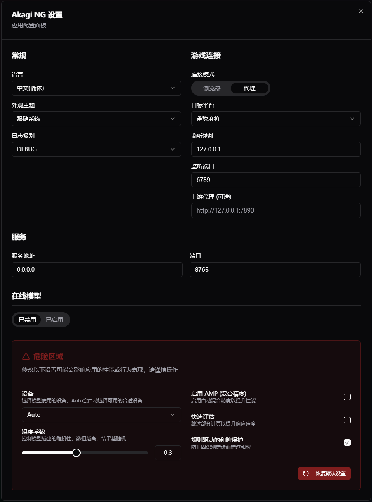

<div align="center">
  
  <h1>Akagi-NG</h1>

  <p>
    Next Generation Mahjong AI Assistant<br>
    Inspired by <b>Akagi</b> and <b>MajsoulHelper</b>
  </p>
<p><i>「死ねば助かるのに……」— 赤木しげる</i></p>

  
  
  
</p>

<p align="center">
  <b>简体中文</b> | <a href="./README.md">English</a>
</p>
</div>

---

## 什么是 Akagi-NG？

**Akagi-NG** 是原 **Akagi** 项目的次世代版本。

这是一款专为日本麻将（立直麻将）设计的 AI 辅助工具，旨在为线上麻将游戏对局提供实时局势分析与决策建议。

Akagi-NG 的核心理念：

- **现代化架构**：基于 Python 3.12 与 React/Vite 重写
- **解耦合设计**：核心逻辑、用户界面、配置管理与 AI 模型彻底分离
- **高性能推理**：集成 `libriichi` 获取极速的 Mortal 模型推理能力
- **长期可维护性**：优化的代码结构便于持续迭代

---

## ⚠️ 免责声明

本项目**仅供教育及研究使用**。

在网络游戏中使用第三方辅助工具可能违反游戏的服务条款。
Akagi-NG 的作者及贡献者**不对任何使用后果负责**，包括但不限于**账号被封禁或冻结**。

请您在使用前充分了解并自行承担相关风险。

---

## 功能特性

- 🎮 **支持平台**
  - 雀魂麻将 (Mahjong Soul)
  - 天凤 (Tenhou)
  - 麻雀一番街 (Riichi City)
  - 天月麻雀 (Amatsuki Mahjong)

- 🀄 **支持模式**
  - 四人麻将 (4p)
  - 三人麻将 (3p)

- 🤖 **AI模型**
  - Mortal (Mortal 4p / Mortal 3p)
  - AkagiOT (AkagiOT 4p / AkagiOT 3p)

- 🧠 **核心功能**
  - 实时手牌分析与 AI 何切推荐
  - 立直模拟推演 (Riichi Lookahead) - 智能推荐最佳立直舍牌
  - 完整的副露支持 (吃/碰/暗杠/加杠/大明杠)
  - 现代化的 Web 浮窗/叠加层 UI
  - 多语言支持 (简体中文 / 繁體中文 / 日本語 / English)

> [!NOTE]
> **Riichi Lookahead（立直模拟推演）** 是 Akagi-NG 中的一项核心功能，旨在解决“当 AI 建议立直时，我应该切哪张牌？”的问题。
>
> <details>
> <summary><b>点击查看立直模拟推演的详细逻辑</b></summary>
>
> **1. 为什么需要它？**
>
> 当 MJAI 引擎（如 Mortal）建议执行 `立直` 操作时，协议返回的动作仅仅是 `{"type": "reach"}`。它**不会**直接告诉我们立直后应该切哪张牌（例如 `6m`）。
> 然而，对于用户来说，点击“立直”按钮后，下一步必须切出一张牌。如果没有 Lookahead，用户只能瞎猜或者自己判断切哪张，这可能会导致 AI 建议的立直策略无法正确执行（例如切了错误的牌导致振听或放铳）。
>
> **2. 工作原理**
>
> Lookahead 的核心思想是**“模拟未来”**。当 AI 建议立直时，我们创建一个临时的平行宇宙，假设玩家已经声明了立直，然后问 AI 在那个状态下会切什么牌。
>
> 流程分为以下几步：
>
> 1. **触发**：当前局面下，AI 引擎经过推理，认为 `立直 (riichi)` 是前 5 名的最佳动作之一。
> 2. **启动模拟**：Akagi-NG 创建一个新的、临时的 `Simulation Bot`（模拟机器人）。
> 3. **历史重放 (History Replay)**：
>    - 为了让模拟机器人达到当前的游戏状态，我们需要把从开局到现在发生的所有事件（摸牌、打牌、吃碰杠等）全部喂给它一遍。
>    - **旧机制**：在重放每一手“自己的动作”时，模拟机器人都会傻乎乎地去问 AI 引擎：“这时候我该干嘛？”。这导致了一局游戏进行到第 15 巡时，Lookahead 需要进行 15 次以上的 AI 推理。对于 Online 模式，这就是 15 次 HTTP 请求，瞬间触发 429 封禁。
>    - **新机制 (ReplayEngine)**：我们现在使用 ReplayEngine 包装器。在重放阶段，我们明确知道这只是在“复述历史”，所以当模拟机器人问“这时候我该干嘛？”时，ReplayEngine 直接返回一个哑动作（如 `摸切 (tsumogiri)`），**完全跳过 AI 推理**。这使得重放过程几乎是瞬时的，且零网络消耗。
> 4. **分支 (Branching)**：
>    - 当状态完全恢复到“现在”后，我们手动向模拟机器人发送一个 `立直 (riichi)` 事件。
>    - 此时，模拟机器人的内部状态就变成了：“玩家刚刚宣布了立直，正等待切牌”。
> 5. **最终推理 (Final Inference)**：
>    - 在这个“宣布立直”的新状态下，我们向 AI 引擎发起一次**真实**的询问：“现在最佳切牌是什么？”
>    - 引擎会根据局面分析，返回具体的切牌动作（例如 `打 6m`）。
> 6. **结果展示**：前端 UI 接收到这个`6m`的信息，界面上会既会高亮显示立直和其他切牌推荐（比如`默听 (damaten)`），也会在立直推荐的子条目展示建议切出的那张`6m`。若立直切牌候选多于1种，子条目中会分别展示每张立直切牌和置信度。
> </details>

## 运行截图

### 主界面


### 设置面板



## 演示视频

<video controls muted playsinline width="720">
  <source src="https://cdn.jsdelivr.net/gh/Xe-Persistent/CDN-source/video/akagi_ng_demo.mp4" type="video/mp4; codecs=av01">
  <source src="https://cdn.jsdelivr.net/gh/Xe-Persistent/CDN-source/video/akagi_ng_demo.h264.mp4" type="video/mp4">
</video>

---

## 安装与使用

### 1. 下载程序

请前往 [Releases](../../releases) 页面下载最新版本的压缩包。

### 2. 部署资源

Akagi-NG 需要外部模型文件和依赖库才能运行。
请确保 `akagi-ng.exe` 所在目录结构完整（需包含以下文件夹）：

```plain
akagi-ng/
  ├── akagi-ng.exe
  ├── config/          # 配置文件目录
  ├── lib/             # libriichi 本地扩展库 (.pyd)
  │     ├── libriichi.pyd
  │     └── libriichi3p.pyd
  └── models/          # Mortal 模型权重文件 (.pth)
        ├── mortal.pth
        └── mortal3p.pth
```

### 3. 启动与退出

第一次运行 `akagi-ng.exe`时，程序默认以浏览器 (Playwright) 模式启动，将启动一个独立的浏览器窗口进入雀魂，并加载辅助 UI 界面。

以代理模式运行 Akagi-NG 时，程序将启动一个系统浏览器窗口进入 UI 界面，不会自动打开雀魂页面。

如需退出程序，请直接关闭 `akagi-ng.exe` 的网页，或者点击界面右上角的红色电源图标。

> [!CAUTION]
> 请注意，以代理模式运行Akagi-NG时，关闭浏览器窗口**不会**自动退出后台程序。

### 4. 配置

Akagi-NG 的所有配置均位于 `config/settings.json` 文件中。您可以点击页面右上角的齿轮图标进入设置面板来修改，也可以使用文本编辑器修改此文件来调整程序行为。

### 5. 浏览器 (Playwright) 模式

这是 Akagi-NG 的**默认工作模式**，也是最推荐的模式。

在此模式下，Akagi-NG 会启动一个独立的、纯净的 Chromium 浏览器窗口（基于 Playwright 技术）。

- **优点**：
  - **无需配置**：不需要安装证书，不需要设置系统代理，开箱即用。
  - **环境隔离**：与您日常使用的浏览器完全隔离，互不干扰。
  - **安全稳定**：直接从游戏服务器接收数据，稳定性高。

- **使用方法**：
  1. 确保 `config/settings.json` 中 `browser.enabled` 为 `true`（默认即为 true）。
  2. 双击运行 `akagi-ng.exe`。
  3. 程序会自动打开一个浏览器窗口，请在此窗口中登录雀魂账号并开始游戏。

### 6. MITM 模式

Akagi-NG 支持通过中间人攻击 (MITM) 方式截获游戏数据，这允许您使用任意浏览器或移动设备上（配合代理）进行对局。

1. **启用配置**:
   在 `config/settings.json` 中添加或修改 `mitm` 字段：

   ```json
   "mitm": {
       "enabled": true,
       "host": "127.0.0.1",
       "port": 6789
   }
   ```

2. **设置代理**:
   将您的浏览器或系统代理设置为 `127.0.0.1:6789`。

3. **安装证书**:

   > 注意：如果您使用了方案 B (Clash 分流)，可能无法打开 mitm.it。推荐使用**方法二**。
   - **方法一：在线安装 (推荐方案 A 用户)**
     - 启动 Akagi-NG。
     - 访问 [http://mitm.it](http://mitm.it)。
     - 下载 Windows 证书 (p12 或 cer)。

   - **方法二：本地安装 (推荐方案 B 用户)**
     - 找到用户目录下的 `.mitmproxy` 文件夹 (例如 `C:\Users\<YourName>\.mitmproxy`)。
     - 双击 `mitmproxy-ca-cert.p12` 进行安装。

   - **关键步骤**：
     - 双击证书 -> 安装证书 -> 存储位置选“**受信任的根证书颁发机构**” (Trusted Root Certification Authorities)。

> [!WARNING]
> 务必将证书安装到“**受信任的根证书颁发机构**” (Trusted Root Certification Authorities)。

### 7. 常见问题 (FAQ)

**Q: 我正在使用 Clash/v2rayN 等代理软件 (TUN/系统代理模式)，如何配置？**

#### 配置方案 A: 浏览器网页版 (SwitchyOmega 代理)

此方案适合**网页版**玩家，配置最简单且完全隔离。

**配置步骤 (以 Clash Verge Tun 模式为例)**：

1. **准备环境**：
   - 保持 Clash Verge 的 Tun 模式 **开启**。
   - 确保 Akagi-NG 已启动且 `mitm.enabled` 为 `true` (端口默认 6789)。

2. **安装 SwitchyOmega**:
   - Chrome/Edge 用户请在商店搜索并安装 "SwitchyOmega"。

3. **配置情景模式**:
   - 打开 SwitchyOmega 设置界面。
   - 点击左侧 **"新建情景模式"** -> 命名为 `Akagi-Mitm` -> 类型选择 **"代理服务器"**。
   - 在 `Akagi-Mitm` 的设置中：
     - 协议：`HTTP`
     - 服务器：`127.0.0.1`
     - 端口：`6789`
   - 点击左侧 **"应用选项"** 保存。

4. **配置自动切换 (关键)**:
   - 点击左侧 **"自动切换"** (Auto Switch)。
   - 删除所有现有规则（如果有）。
   - **添加规则**：
     - 规则匹配：`*.maj-soul.com  ->  Akagi-Mitm`
     - 规则匹配：`*.majsoul.com  ->  Akagi-Mitm`
     - 规则匹配：`*.mahjongsoul.com  ->  Akagi-Mitm`
   - **默认规则** (Default)：
     - 选择 **"直接连接"** (Direct)，然后点击 **"应用选项"** 保存。

> [!TIP]
> 因为您的系统已经开启了 Tun 模式，"直连"的流量会自动被 Tun 网卡接管并代理，所以不需要在这里选"系统代理"或"Clash"。

> [!IMPORTANT]
> 如果您没开 Tun 模式，仅开了系统代理，这里请选"系统代理"

5. **开始游戏**:
   - 点击浏览器右上角 SwitchyOmega 图标，选择 **"自动切换"**。
   - 访问雀魂网页版，Akagi-NG 应该能正常获取游戏事件，同时您依然可以访问 Google/YouTube (走 Tun)。

#### 配置方案 B: 雀魂客户端 (Clash 规则分流)

此方案适合**PC/Steam客户端**玩家。由于客户端无法像浏览器那样使用插件分流，我们需要直接修改 Clash 配置，让它把游戏流量转发给 Akagi-NG。

> [!IMPORTANT]
> 使用PC/Steam客户端游玩时，请确保 Clash 处在 TUN 模式下，否则将无法代理客户端流量

1. **找到配置入口**:
   - 在 Clash Verge 中找到您的配置文件（或者使用 "Merge" / "Script" 功能进行注入，以免覆盖原配置）。

2. **添加代理节点 (Proxies)**:
   定义一个指向 Akagi-NG 本地代理的节点。

   ```yaml
   proxies:
     - name: Akagi-Mitm
       type: http
       server: 127.0.0.1
       port: 6789
       tls: false
   ```

   还可以定义一个代理组 (Proxy-groups)，里面包含本地代理节点和直连 (Direct)，这样方便切换是否使用 Akagi-NG 本地代理。

   ```yaml
   proxy-groups:
     - name: 🀄 雀魂麻将
       proxies:
         - Akagi-Mitm
         - DIRECT
       type: select
   ```

3. **添加分流规则 (Rules)**:
   将雀魂相关域名强制指向上面定义节点。请注意规则顺序，建议放在靠前位置。

   ```yaml
   rules:
     - PROCESS-NAME,雀魂麻將,🀄 雀魂麻将
     - PROCESS-NAME,Jantama_MahjongSoul.exe,🀄 雀魂麻将
     - DOMAIN-Keyword,maj-soul,🀄 雀魂麻将
   ```

4. **应用配置**:
   保存并刷新 Clash 配置。现在启动雀魂客户端，流量路径为：
   `雀魂客户端 -> Clash (TUN) -> 匹配到 Rules -> 转发给 Akagi-NG (6789) -> 您的网络/上游代理`

---

## 源码构建指南

### 环境依赖

- Python **3.12+**
- Node.js & npm (用于编译前端)
- Windows (推荐开发环境)
- Git

### 1. 克隆与初始化

```bash
git clone https://github.com/Xe-Persistent/Akagi-NG.git
cd Akagi-NG

# 创建并激活虚拟环境
python -m venv .venv
.venv\Scripts\activate

# 安装开发依赖
pip install -e .
python -m playwright install
```

### 2. 编译前端资源

```bash
cd akagi_frontend
npm install
npm run build
```

### 3. 调试运行

```bash
python -m akagi_ng
```

### 4. 封装发布包

构建独立的 ZIP 发布包（包含可执行文件）：

```bash
python scripts/build_release.py
```

构建产物将生成于 `dist/` 目录下。

---

## 开源协议

本软件遵循 [GNU Affero General Public License version 3 (AGPLv3)](LICENSE) 开源协议。
